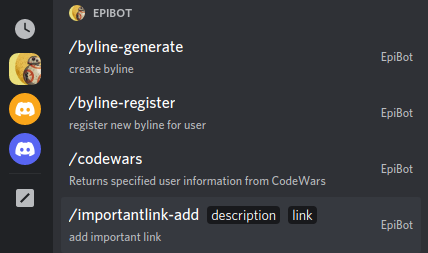

## EpiBot Discord Bot

By Kate Kiatsiri, Aaron Minnick, Anna Pittman, Jeff Terrell, Colt Thatcher, and Hannah Young

A [Discord](https://discord.com) bot that provides various functionality to assist [Epicodus](https://www.epicodus.com) students and instructors.

### Technologies Used

- C#
- .NET
- MySQL
- Entity Framework
- Discord.NET

### Description

This is a Discord bot utilizing the (Discord.NET)[https://discordnet.dev/index.html] library. It provides a variety of functions to assist Epicodus students and instructors. Full feature list below.

---

## Setup Your Own Bot

#### Requirements

* [git](https://git-scm.com)
* [.NET](https://dotnet.microsoft.com/en-us/)
* [MySQL](https://www.mysql.com/)

#### Generate bot token and permissions

1. Navigate to the [Discord Developer Portal](https://discord.com/developers/applications/)
2. Create a new application
3. Give the application a name (this will be the bot's initial username)
4. On the left-hand sidebar, under `Settings`, click `Bot`
5. Click `Add Bot`
6. Confirm the popup
7. Under `Token` (next to the bot's icon), click `Copy`. Keep this token handy for now

#### Add bot to server

1. Back on the [Discord Developer Portal](https://discord.com/developers/applications/), click on your application
2. On the left-hand sidebar, click `OAuth2` to expand the dropdown, and then select `URL Generator`
3. Under `Scopes`, select `bot` and `applications.commands`
4. Under `Bot Permissions`, select `Administrator` (optional: or select only the permissions you need)
5. Navigate to the provided URL and follow the prompts to add your bot to the desired server
6. Select `Authorize`

#### To start bot

1. Download and install the [.NET 5.0 SDK](https://dotnet.microsoft.com/en-us/download/dotnet/5.0) as required for your system. Be sure to add the .NET sdk to your PATH
2. Use terminal to navigate to desired parent directory and use `git clone https://github.com/Corgibyte/epibot.git EpiBot.Solution`
3. Navigate into the project directory nested inside the .Solution directory: `cd EpiBot.Solution/EpiBot`
4. Create an appsettings.json file: `touch appsettings.json`
5. Edit the new appsettings.json file and add the following, making sure to replace the indicated sections with your MySQL user ID and password and your Discord Token generated above in `Generate bot tokens and permissions`: step 7
```
{
  "ConnectionStrings": {
    "DefaultConnection": "Server=localhost;Port=3306;database=epibot;uid=[YOUR MYSQL USER ID];pwd=[YOUR MYSQL PASSWORD];"
  },
  "DiscordToken": "[YOUR DISCORD TOKEN]"
}
```
6. Back in the terminal, in the EpiBot directory build the project: `dotnet build`
7. Create database from migration data: `dotnet ef database update`
8. Run project: `dotnet run`

### Interacting with the bot

The bot has two types of interactions: text commands and slash commands. Text commands are performed by sending a message whose first character is either the prefix `!` or a Discord mention targeting the bot, followed by the command and then any parameters the command requires. 

**Examples:**

```
!help
```
or
```
@EpiBot#4471 help
```

Slash commands are performed by entering the `/` character into the message field. This will bring up a menu of all slash commands on that server, and can be filtered by the provider of the command. A menu will display the commands (filtered as you begin typing), and the selected command's parameters will be shown. You can navigate the menu with the keyboard or mouse.



---

## Commands

TODO

--------------------

### Known bugs:

* None

### License

[Hippocratic License 3.0](https://github.com/Corgibyte/epibot/blob/main/LICENSE.md), Copyright 2022 Kate Kiatsiri, Aaron Minnick, Anna Pittman, Jeff Terrell, Colt Thatcher, and Hannah Young.
